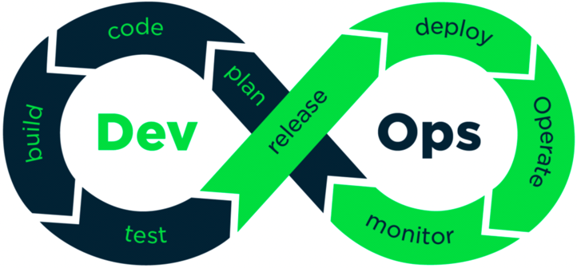
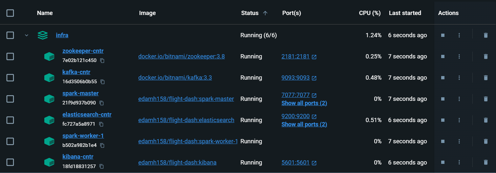
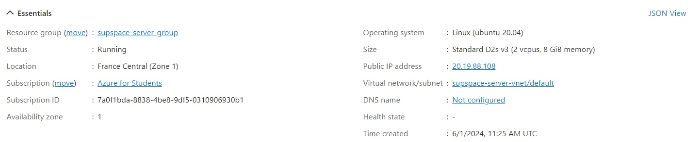

# Real-Time-flight-into-data-pipeline Dashboard with CI/CD Pipeline & Tests


## Continuous Integration & Continuous Delivery Pipeline for a CI/CD Pipeline for Real-Time Flight Analysis Application

CI/CD pipelines allow for a fast response to business needs, while other DevOps practices support stable, secure and predictable services, striking the perfect balance  between stability and the speed of change.

This is a project by Edam Hamza realized for learning purposes.

It creates a Github Actions CI/CD pipeline for a CI/CD Pipeline for Real-Time Flight Analysis Application, with Pytest for unit tests & Ruff for linting.



### Requirements and coverage

- [x] The application must be containerized
- [x] The application must communicate with a NoSQL database
- [x] It must be possible to test the pipeline locally (e.g. not require a cloud provider account)
- [x] Pushing to master must trigger a pipeline that terminates with a deployment to production (Continuous Delivery)
- [x] The underlying application must be a kibana-based dashboard that inspires from existing flight-management dashboards.

### The Technological Stack

Currently the project uses the following technologies:

- Docker (incl. Docker Compose)
- ElasticSearch, Kibana, Spark and Kafka
- Pytest (for unit tests)
- Dockerhub
- Github Actions

#### Brief Description

The solution involves retrieving real-time data from the Airlabs API, which contains a wealth of information related to air traffic and airport density. The data is transmitted through a Kafka producer and recorded in a topic named flight. For data processing, we use Apache Spark. The Spark session subscribes to the flight topic and downloads the data from it. After the processing operation, the data is sent to Elasticsearch and recorded in the esflight index of Elasticsearch. Using the Kibana dashboard, we can visualize the data in real time and with precision. The GitHub Actions part of our solution allows us to automate the deployment of the real-time data processing pipeline. When a change is made on GitHub, GitHub Actions triggers to execute multiple jobs. First, the Docker images of the various components are rebuilt. Then, these images are deployed on an Azure virtual machine. This continuous integration ensures that our system is always up-to-date and operational, enabling efficient real-time data management and precise visualization via the Kibana dashboard.


### Application Architecture


Our project pipeline is as follows:

**Kafka:** Ingests real-time data from airlabs api.
**Spark:** Processes and analyzes the data.
**Elasticsearch:** Stores and indexes the processed data.
**Kibana:** Visualizes insights on an interactive dashboard.
**GitHub Actions:** Automate workflows and development tasks on GitHub.
**Azure:** To host the data pipeline


## Folder structure

This project has the following file structure:
```
+- infra                <--- Docker-Compose file & All necessary assets to build the infrastructure
|
+- tests                <--- Unit tests using Pytest
|
+- utils                <--- Logic & Utilities for the main module (Mainly handles API & Kafka streaming)
|
+- workflows            <--- DevOps IaaC, including pipeline
```

## Dockerized Environment

To ensure seamless operation and management, our Real-time-flight-into-data-pipeline is built upon a Dockerized environment, encapsulating each component of the system within its own container. This approach not only fosters a modular architecture, making it easier to update and maintain individual parts without affecting the whole system, but also enhances scalability and fault tolerance. Each service, from Kafka for real-time data ingestion to Kibana for insightful visualizations, operates in an isolated yet interconnected manner through a custom Docker network. This setup not only reflects best practices in container orchestration but also provides a robust, scalable solution for real-time data processing and visualization. By adopting this architecture, users can enjoy a streamlined setup process, predictable behavior across environments, and a flexible system ready to adapt to future needs and improvements.



## Services

### Zookeeper
- **Purpose**: Manages and coordinates distributed services.
- **Image**: `docker.io/bitnami/zookeeper:3.8`

### Kafka
- **Purpose**: A distributed streaming platform that uses Zookeeper for managing clusters.
- **Image**: `docker.io/bitnami/kafka:3.3`
- **Depends On**: `zookeeper`

### Spark Master
- **Purpose**: Manages the Spark cluster and submits jobs.
- **Custom Dockerfile**: `spark/Dockerfile.spark`
- **Reason for Custom Build**: To install Python dependencies, Scala, and configure Spark with specific scripts.

### Spark Worker
- **Purpose**: Executes tasks in the Spark cluster.
- **Custom Dockerfile**: `spark/Dockerfile.spark`
- **Reason for Custom Build**: Shares the same build as Spark Master for consistency.

### Elasticsearch
- **Purpose**: Stores and indexes data for search and analytics.
- **Custom Dockerfile**: `elasticsearch/Dockerfile.elastic`
- **Reason for Custom Build**: To install Python dependencies and add custom scripts for index creation.

### Kibana
- **Purpose**: Visualizes data stored in Elasticsearch.
- **Custom Dockerfile**: `kibana/Dockerfile.kibana`
- **Reason for Custom Build**: To install additional utilities and include custom scripts for loading data.

## Custom Dockerfiles

### Spark Dockerfile

```dockerfile
# Start from the Bitnami Spark image
FROM bitnami/spark:3.2.4

# Switch to root to install packages
USER root

# Update the package list and install python3-pip, curl, telnet, and other utilities
RUN apt-get update && \
    apt-get install -y python3-pip curl telnet && \
    rm -rf /var/lib/apt/lists/*

# Install Scala 2.12
RUN curl -LO https://downloads.lightbend.com/scala/2.12.15/scala-2.12.15.tgz && \
    tar -xzvf scala-2.12.15.tgz -C /opt/ && \
    rm scala-2.12.15.tgz && \
    mv /opt/scala-2.12.15 /opt/scala

# Set up environment variables for Scala
ENV SCALA_HOME /opt/scala
ENV PATH $PATH:$SCALA_HOME/bin

# Create the checkpoints directories and ensure the non-root user has write access
RUN mkdir -p /opt/bitnami/spark/checkpoints/flight && \
    chown -R 1001:1001 /opt/bitnami/spark/checkpoints

# Copy spark file into a container
COPY spark/spark_stream.py /opt/bitnami/spark/spark_stream.py

# Install the Elasticsearch client for Python
RUN pip install spark pyspark

# Copy create index file into app directory into a spark container
COPY spark/airports_external.csv /opt/bitnami/spark/airports_external.csv

# Switch back to the default user
USER 1001
```

### ElasticSearch Dockerfile

```dockerfile
# Start from the Bitnami Elasticsearch image
FROM bitnami/elasticsearch:8.8.2

# Switch to root user for installation and setup
USER root

# Update package list and install Python 3 and pip
RUN apt-get update && apt-get install -y python3 python3-pip \
    # Change ownership of Elasticsearch directory to non-root user
    && chown -R 1001:1001 /opt/bitnami/elasticsearch \
    # Set permissions for Elasticsearch directory
    && chmod 775 /opt/bitnami/elasticsearch

# Install specific version of Elasticsearch Python client
RUN pip3 install elasticsearch==8.8.2

# Copy custom scripts for Elasticsearch
COPY elasticsearch/create_index_elastic.py /usr/share/elasticsearch/scripts/create_index_elastic.py
COPY elasticsearch/custom_cmd.sh /usr/share/elasticsearch/scripts/custom_cmd.sh

# Set executable permissions for custom scripts
RUN chmod +x /usr/share/elasticsearch/scripts/custom_cmd.sh

# Switch back to non-root user for security
USER 1001

# Set entrypoint and default command for container
ENTRYPOINT [ "/opt/bitnami/scripts/elasticsearch/entrypoint.sh" ]
CMD [ "/usr/share/elasticsearch/scripts/custom_cmd.sh" ]
```

### Elasticsearch Custom Command (`custom_cmd.sh`)

The `infra/elasticsearch/custom_cmd.sh` script for Elasticsearch orchestrates several important tasks upon container startup:

```bash
#!/bin/bash

# Load logging library for informative messages
. /opt/bitnami/scripts/liblog.sh

# Run the setup script to configure Elasticsearch
info "Starting Elasticsearch setup"
/opt/bitnami/scripts/elasticsearch/setup.sh 
info "Elasticsearch setup finished!"

# Start Elasticsearch using the default run script
info "Starting Elasticsearch service"
/opt/bitnami/scripts/elasticsearch/run.sh &

# Wait for Elasticsearch to become available
info "Waiting for Elasticsearch to start"
while true; do
    curl -s http://localhost:9200 && break
    sleep 1
done

# Execute a Python script to create an Elasticsearch index
info "Executing create_index_elastic.py"
python3 /usr/share/elasticsearch/scripts/create_index_elastic.py
info "create_index_elastic.py executed successfully"

# Keep the container running
tail -f /dev/null
```

- **Setup**: Runs the Elasticsearch setup script (`setup.sh`) to initialize Elasticsearch configuration.
- **Service Start**: Executes the default run script (`run.sh`) to start Elasticsearch as a background process.
- **Health Check**: Periodically checks Elasticsearch's availability using `curl` until it responds at `http://localhost:9200`. This is to make sure the Python Script is run after ES is up and ready.
- **Index Creation**: Runs a Python script (`create_index_elastic.py`) to set up an Elasticsearch index & its mappings.
- **Container Management**: Keeps the container running by tailing `/dev/null`, ensuring it remains active.

### Kibana Custom Command:

### Kibana Dockerfile

```dockerfile
# Start from the Bitnami Kibana image
FROM bitnami/kibana:8.8.2

# Switch to root user for installation and setup
USER root

# Update package list and install necessary utilities
RUN apt-get update && \
    apt-get install -y bash curl jq && \
    apt-get clean && \
    rm -rf /var/lib/apt/lists/* && \
    # Change ownership of Kibana directory to non-root user
    chown -R 1001:1001 /opt/bitnami/kibana && \
    # Set permissions for Kibana directory
    chmod 775 /opt/bitnami/kibana

# Copy custom scripts for Kibana
COPY kibana/export.ndjson /usr/share/kibana/scripts/export.ndjson
COPY kibana/load_ndjson.sh /usr/share/kibana/scripts/load_ndjson.sh
COPY kibana/custom_cmd.sh /usr/share/kibana/scripts/custom_cmd.sh

# Set executable permissions for custom script
RUN chmod +x /usr/share/kibana/scripts/custom_cmd.sh

# Switch back to non-root user for security
USER 1001

# Set entrypoint and default command for container
ENTRYPOINT [ "/opt/bitnami/scripts/kibana/entrypoint.sh" ]
CMD [ "/usr/share/kibana/scripts/custom_cmd.sh" ]
```

### Kibana Custom Command (`custom_cmd.sh`)

The `infra/kibanacustom_cmd.sh` script for Kibana manages essential operations during container initialization:


```bash
#!/bin/bash

# Load logging library for informative messages
. /opt/bitnami/scripts/liblog.sh

# Run the setup script to configure Kibana
info "Starting Kibana setup"
/opt/bitnami/scripts/kibana/setup.sh 
info "Kibana setup finished!"

# Start Kibana using the default run script
info "Starting Kibana service"
/opt/bitnami/scripts/kibana/run.sh &

# Execute a script to export data (assuming it's `load_ndjson.sh`)
info "Exporting data from Kibana"
/usr/share/kibana/scripts/load_ndjson.sh
info "Exporting data completed"

# Keep the container running
tail -f /dev/null
```
- **Setup**: Executes the Kibana setup script (`setup.sh`) to configure Kibana settings.
- **Service Start**: Starts Kibana using the default run script (`run.sh`) as a background process.
- **Data Export**: Runs a script (`load_ndjson.sh`) to load data for the dashboard into Kibana.
- **Container Management**: Ensures the container remains active by tailing `/dev/null`.

## Prerequisites

- Docker Desktop: Ensure Docker Desktop is installed and running on your system.
- Python: Ensure Python is installed for running the Kafka producer script.

## Setup and Running Instructions
1. Build & Start the Docker Containers: 
    ```
    docker-compose -f infra/docker-compose.yml up -d --build
    ```
2. Install Python dependencies:
    ```
    pip install -r requirements.txt
    ```
4. Run the Kafka Producer:
    
    Main script handles different modes of operation.

    **Modes:**
    - **stream:** Streams data using Kafka directly from the API (This is the intended behavior of the application) 
    - **export:** Exports data from the airlab API endpoint to a JSON file for testing purposes.
    - **test:** Tests a module with data from said JSON file.

    **Command-line Arguments:**
    - **mode:** Choose the mode to run the script: stream, test, or export.
    - **--filename (optional):** Specify the filename for export or testing modes (defaults to 'dummy_data.json').

    **Example Usage:**
    - **Stream data:** 
    ```
    python kafka_stream.py stream
    ```
    - **Export data to a custom filename:** 
    ```
    python kafka_stream.py export --filename custom_data.json
    ```
    - **Test module with a custom filename:** 
    ```
    python kafka_stream.py test --filename custom_data.json
    ```

6. Access Kibana Dashboard at `http://localhost:5601`.
 `
> [!NOTE]
> The dashboard is automatically imported to your local Kibana Image during its build.

## How to launch kibana dashboard 

- Open http://localhost:5601/ in your browser.
- Go to Management>StackManagement>Kibana>Saved Objects
- Open dashboard

## Github Actions Pipeline

This CI/CD pipeline is designed to automate the testing, building, and deployment of the Real-Time Flight Analysis Application. The pipeline is triggered by a push event in the GitHub repository.

## Pipeline Structure

The pipeline consists of the following jobs:

1. **Testing-Phase**: This job is responsible for setting up the environment, installing dependencies, running tests, and performing code linting.
```yaml
  Testing-Phase:
    runs-on: ubuntu-latest
    steps:
      - uses: actions/checkout@v4
      - name: Set up Python
        uses: actions/setup-python@v5
        with:
          python-version: '3.11.4'
      - name: Install dependencies
        run: |
          pip install --upgrade pip
          pip install -r requirements.txt
      - name: Test with pytest
        run: |
          pip install pytest pytest-cov
          pytest tests/ --doctest-modules --junitxml=junit/test-results.xml --cov=utils --cov-report=xml --cov-report=html
      - name: Lint with Ruff
        run: |
          pip install ruff
          ruff check --output-format=github .
        continue-on-error: true
      - name: Upload pytest test results
        uses: actions/upload-artifact@v4
        with:
          name: pytest-results
          path: |
            junit/test-results.xml
            htmlcov
        if: ${{ always() }}
```
2. **Build-and-Push-Images**: This job builds and pushes Docker images if there are changes in the `infra/` directory. It depends on the successful completion of the `Testing-Phase`.

```yaml
Build-and-Push-Images:
    runs-on: ubuntu-latest
    if: ${{ github.event_name == 'push' && contains(github.event.head_commit.modified, 'infra/') }}
    needs: Testing-Phase  
    steps:
      - name: Checkout code
        uses: actions/checkout@v4
      - name: Build and push Docker images
        env:
          DOCKER_HUB_USERNAME: ${{ secrets.DOCKER_HUB_USERNAME }}
          DOCKER_HUB_PASSWORD: ${{ secrets.DOCKER_HUB_PASSWORD }}
        run: |
          docker-compose -f infra/docker-compose.yml build
          echo "${DOCKER_HUB_PASSWORD}" | docker login -u "${DOCKER_HUB_USERNAME}" --password-stdin
          docker-compose -f infra/docker-compose.yml push
```
## Job Details

### Testing-Phase

- **Runs on**: `ubuntu-latest`
- **Steps**:
  1. **Checkout Code**:
     - Uses the `actions/checkout@v4` action to checkout the repository.
  2. **Set up Python**:
     - Uses the `actions/setup-python@v5` action to set up Python 3.11.4.
  3. **Install Dependencies**:
     - Runs `pip install --upgrade pip` and `pip install -r requirements.txt` to install the required dependencies.
  4. **Test with pytest**:
     - Installs `pytest` and `pytest-cov`.
     - Runs tests in the `tests/` directory, generates test reports in JUnit XML format, and generates coverage reports in XML and HTML formats.
  5. **Lint with Ruff**:
     - Installs `ruff` and performs linting.
     - Uses `continue-on-error: true` to proceed even if linting errors are found.
  6. **Upload pytest Test Results**:
     - Uses `actions/upload-artifact@v4` to upload the test results and coverage reports.

### Build-and-Push-Images

- **Runs on**: `ubuntu-latest`
- **Condition**: Runs only if the event is a `push` and files in the `infra/` directory have been modified.
- **Depends on**: `Testing-Phase`
- **Steps**:
  1. **Checkout Code**:
     - Uses the `actions/checkout@v4` action to checkout the repository.
  2. **Build and Push Docker Images**:
     - Builds Docker images using `docker-compose -f infra/docker-compose.yml build`.
     - Logs in to Docker Hub using secrets and pushes the built images using `docker-compose -f infra/docker-compose.yml push`.

## Future Enhancements

The pipeline includes commented-out sections for deploying to Azure, which can be enabled as needed:

1. **azure_login**: Connects to Azure Cloud using the `azure/login@v2` action.
2. **ssh_to_azure**: Establishes an SSH connection to an Azure VM using the `appleboy/ssh-action@master` action.
3. **deploy_docker_compose**: Deploys the Docker Compose setup to an Azure VM.

```yaml
azure_login:
  name: Connect to Azure Cloud
  runs-on: ubuntu-latest
  needs: checkout
  steps:
    - name: Connect and configure Azure Cloud
      uses: azure/login@v2
      with:
        creds: ${{ secrets.AZURE_CREDENTIALS }}

ssh_to_azure:
  name: SSH to Azure VM
  runs-on: ubuntu-latest
  needs: azure_login
  steps:
    - name: SSH to Azure VM
      uses: appleboy/ssh-action@master
      with:
        host: ${{ secrets.SSH_HOST }}
        username: ${{ secrets.SSH_USERNAME }}
        key: ${{ secrets.SSH_PRIVATE_KEY }}
        port: ${{ secrets.SSH_PORT }}
        script: |
          echo "SSH connection established."
deploy_docker_compose:
  name: Deploy Docker Compose to Azure VM
  runs-on: ubuntu-latest
  needs: ssh_to_azure
  steps:
    - name: Checkout code
      uses: actions/checkout@v3

    - name: Run Docker Compose
      run: |
        ssh -o StrictHostKeyChecking=no -i /home/runner/.ssh/id_rsa ${{ secrets.SSH_USERNAME }}@${{ secrets.SSH_HOST }} << 'EOF'
             newgrp docker
             cd /home/${{ secrets.SSH_USERNAME }}/repository
             docker-compose up -d
```

## Secrets Management

The pipeline uses GitHub Secrets to manage sensitive information, including:
- `DOCKER_HUB_USERNAME`
- `DOCKER_HUB_PASSWORD`
- `AZURE_CREDENTIALS`
- `SSH_HOST`
- `SSH_USERNAME`
- `SSH_PRIVATE_KEY`
- `SSH_PORT`

### Setting a Secret in Your Repository

To set a secret in your GitHub repository, follow these steps:

1. **Navigate to Your Repository**:
   - Go to the GitHub website and navigate to the repository where you want to set the secret.

2. **Go to Settings**:
   - Click on the `Settings` tab located at the top of your repository page.

3. **Access Secrets**:
   - In the left sidebar, scroll down and click on `Secrets` and then click on `Actions`.

4. **Add a New Secret**:
   - Click on the `New repository secret` button.

5. **Enter Secret Name and Value**:
   - In the `Name` field, enter the name of your secret (e.g., `DOCKER_HUB_USERNAME`).
   - In the `Value` field, enter the value of the secret (e.g., your Docker Hub username).

6. **Save the Secret**:
   - Click on the `Add secret` button to save the secret.

Repeat these steps for each secret you need to add.

### Example

To add the `DOCKER_HUB_USERNAME` secret:

1. Go to your repository's `Settings`.
2. Click on `Secrets` > `Actions`.
3. Click `New repository secret`.
4. Enter `DOCKER_HUB_USERNAME` in the `Name` field.
5. Enter your Docker Hub username in the `Value` field.
6. Click `Add secret`.

Repeat for `DOCKER_HUB_PASSWORD`, `AZURE_CREDENTIALS`, `SSH_HOST`, `SSH_USERNAME`, `SSH_PRIVATE_KEY`, and `SSH_PORT`.

### Using Secrets in GitHub Actions

In your GitHub Actions workflow file, you can reference these secrets using the `${{ secrets.SECRET_NAME }}` syntax. For example:

```yaml
env:
  DOCKER_HUB_USERNAME: ${{ secrets.DOCKER_HUB_USERNAME }}
  DOCKER_HUB_PASSWORD: ${{ secrets.DOCKER_HUB_PASSWORD }}
```

## Testing and Linting

### Pytest Tests

The project includes automated unit tests using Pytest, located in the `/tests` directory. These tests cover various aspects of the application to ensure its functionality and reliability. To run the tests locally or as part of your CI/CD pipeline, use the following command:

```bash
pytest tests/ --doctest-modules --junitxml=junit/test-results.xml --cov=utils --cov-report=xml --cov-report=html
```

### Linting with Ruff

To maintain code quality and style consistency, the project utilizes Ruff for linting. Ruff helps enforce coding standards and identifies potential issues in the codebase. You can run Ruff with the following command:

```bash
ruff check --output-format=github .
```

This ensures that the codebase adheres to best practices and is free from common coding errors, contributing to overall code quality and maintainability.

### Uploading Pytest Test Results

```yaml
 - name: Upload pytest test results
        uses: actions/upload-artifact@v4
        with:
          name: pytest-results
          path: |
            junit/test-results.xml
            htmlcov
        if: ${{ always() }}
```

Detailed reports of test results and coverage are uploaded as artifacts to GitHub through the CI/CD pipeline. This ensures that comprehensive information about test outcomes and code coverage is accessible within your GitHub repository. The artifacts include:

- **Test Results**: Stored in `junit/test-results.xml`.
- **Coverage Reports**: Saved in the `htmlcov` directory.

> [!NOTE]
> These artifacts are uploaded to and can be acquired from the actions tab in your repository, after every succesful run of the pipeline.

These artifacts provide valuable insights into the project's testing status and code coverage metrics, aiding in monitoring and improving the overall quality of the codebase.

## Deployment to Azure

If you have gotten all of the above to work locally, you are ready to migrate to a remote server. You can chose whatever cloud provider you like.

Azure provides 100$ for students enrolled in a university, or through the Github Student Pack. 

We chose to use Microsoft Azure for our project. In order to create a virtual machine on Azure:

- **1-** Log into your Azure account.
- **2-** Hit the *create virtual machine* button on the screen that appears.
- **3-** This takes you to a different interface where you should hit the *Create* button.
- **4-** This takes you to a third interface containing a form. Follow the instructions to choose the specifications of your machine
- **5-** Once created, go over to *Network Configuration* and open up the HTTP, SSH, Prometheus and Grafana Ports on the firewall.
- **6-** If you chose to access your machine through SSH, a key should have been downloaded to your machine (DO NOT LOSE IT).
- **7-** SSH into your remote server and pull the repository you have created. The command should look something like this `ssh -i remote-machine_key.pem azureuser@public_ip_address`

The image below showcases the machine that we opted to use for this solution:

  

> [!NOTE]
> Chances are, the machine will have been brought down by the time you see this screenshot. That's why the IP@ won't work. 


## Dashboard Showcase
Let us now focus on the graphs developed during the data visualization process. After consulting aviation experts and airport administrators, we have chosen to divide our dashboard into three sections: airport information, flight information, and aircraft information.
### Airport Information
For this section of the dashboard, we focused on information useful for airport administrators, notably the total number of flights related to that airport and the flow of departures and arrivals. The figure above shows an overview for all airports, but the available filters allow selecting a specific airport or region.


### Flight Information
For this part of the dashboard, and following the advice of experts regarding the necessary information, we chose to visualize on the map the position of aircraft, their departure and arrival airports sorted by their speeds or altitudes as needed. Then, on the left, we have for each type of aircraft, the types of routes it operates. We notice that the larger the aircraft, the more capable it is of performing long-haul flights. Similarly, we can see on the right side of the drawing, the most frequent flights by geographical region. This approach provides the most information possible about the nature of flights, their frequencies, and the type of aircraft that operates them.


### Aircraft Information
Finally, for the section related to the aircraft itself, using the data available on the API, we can determine the average and maximum speeds of aircraft as well as their speeds relative to their altitudes to ultimately identify the fastest aircraft and rank them in descending order.


### Filters' addition
In addition to graphics, we have developed a variety of filters that make dashboars customizable and interactive. In particular, we use a filter for the flight code, the departure or arrival, the status of the flight or its type but also the airline and the aircraft code.
The filters can be found in the dashboard header as follows:


## Improvements

Oh, where to start? There are many opportunities to enhance this solution to ensure it meets production standards. Here are some initial areas for improvement:

### Kafka Streaming

- **Optimize Kafka Configurations**: Review Kafka configurations (e.g., `server.properties`) to ensure they are tuned for optimal performance based on your workload and resource constraints. Consider parameters like batch size, message compression, and replication factors.

- **Monitoring and Alerting**: Implement robust monitoring for Kafka clusters using tools like Prometheus and Grafana. Set up alerts for critical metrics such as message lag, throughput, and partition health.

- **Scaling Kafka Consumers**: Evaluate the scalability of Kafka consumers. Implement consumer groups effectively to handle varying loads and ensure timely message processing.

- **Error Handling and Retry Mechanisms**: Enhance error handling and retry mechanisms within Kafka consumers and producers to handle transient failures gracefully and maintain data integrity.

- **Testing Kafka Streams**: Expand testing strategies to include Kafka streams. Implement unit tests, integration tests, and end-to-end tests specifically for Kafka stream processing to validate data transformations and business logic.

These improvements aim to optimize Kafka streaming performance, enhance reliability, and ensure scalability to meet the demands of production environments.

### Security

- **Implement Backups**: Ensure data integrity and disaster recovery by setting up automated backups. Consider using separate Docker containers to manage volumes and create copies.

### Availability

- **Version Control for Images**: Stabilize builds by avoiding mutable images (e.g., using specific versions like `mongo:4.4.0-bionic` instead of `latest`).

- **Persistent Storage Solutions**: Replace Docker named volumes with more persistent solutions, such as cloud storage drivers.

### Operational Efficiency

- **Improved Image Tagging**: Enhance image tagging practices by incorporating project names and versioning to better manage and track Docker images.

### Testing

- **Enhance Test Coverage**: Increase test coverage with a focus on unit tests, integration tests, and end-to-end tests. Use code coverage metrics to guide minimum test requirements.

- **Expand Test Types**: Introduce additional testing types such as stress tests, fuzz tests, and soak tests to ensure robustness under various conditions.

### Performance Optimization

- **Pipeline Optimization**: Address bottlenecks in pipeline execution, particularly for concurrent unit test runs and overall pipeline duration.

- **Reduce Pipeline Runtime**: Optimize pipeline processes to achieve faster execution times, aiming for completion within five minutes or less.

## Project by
<a href="https://https://github.com/EdamH/REAL-TIME-FLIGHT-DATA-CICD-PIPELINE/graphs/contributors">
    
</a>

## Special Thanks to
<a href="https://github.com/AnasBenAmor10/Real-Time-flight-into-data-pipeline/graphs/contributors">
    
</a>